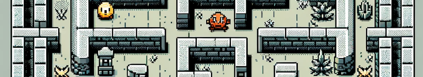

# Maze Runner Game
## Summary
Maze Runner game is developed by Ryuki & Lien. We made this game as a project that is part of Introduction to Programming course. 

## How to play the game
When you reach the exit with minimum one key, you win the game and the game will start over. If you run into enemy and trap, you lose your lives. You will die if your lives become 0. You can go back to main menu or choose new map and restart the game or continue the game through Esc button.

## Code structure
The game is launched by **DesktopLauncher** class.

Classes for running the game include:
1. **MazeRunnerGame**: stores the game's attributes (e.g. skin, map, screens, number of lives) and functions to switch between screens
2. **TileMap**: read properties files then make two-dimensional arrays to represent the game's map
3. **Screen**:
  3.1. _**MenuScreen**_: Welcome to the game
  3.2. _**StartScreen**_: Choose a map
  3.3. _**GameScreen**_: The game is being played after a map is chosen
  3.4. _**PauseScreen**_: The game is paused, you can continue/back/choose another map
  3.5. _**LoseScreen (WinScreen)**_: When you lose (win), this screen shows up
3. **Entity**
  4.1. Static: **_Wall_**, **_Path_**, **_Entry_**, **_Exit_**, **_Tree_** (trees serve as boudaries for the map)
  4.2. Static but lively: **_Live_**, **_Key_**, **_Trap_**
  4.3. Dynamic: **_Player_**, **_Enemy_** (player is moved by key press, while enemies move randomly along paths)
4. **Collision**
 to determine whether the player touches trap/live/exit/key/enemy
 to determine whether the player/enemy's nearby cells along its direction ARE walls or not  
  5.1. _**CollisionEnemy**_: to help the enemy identify nearby cells
  5.2. _**CollisionPlayer**_: to help the player identify nearby cells

## Beyond minimum requirements
There are collectable lives within the game which is one additional feature of our game which go beyond minimum requirements. If you collect a new life within the game, the number of your lives increment by one.

